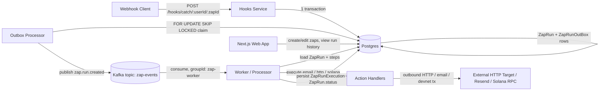

# Zapier Clone — Event-Driven Workflow Automation

A Zapier-style workflow automation platform built to demonstrate backend and
distributed-systems engineering, not to clone Zapier's feature set. One path
is the hero: a webhook trigger durably recorded, published through a
**transactional outbox**, processed asynchronously over **Kafka**, and
executed by a **worker** with **idempotent, resumable** step execution.

## Architecture



## Execution sequence

```mermaid
sequenceDiagram
    participant C as Webhook Client
    participant H as Hooks Service
    participant DB as Postgres
    participant O as Outbox Processor
    participant K as Kafka
    participant W as Worker

    C->>H: POST /hooks/catch/:userId/:zapId
    H->>DB: BEGIN; create ZapRun; create ZapRunOutBox; COMMIT
    H-->>C: 202 Accepted { zapRunId }

    loop poll every OUTBOX_POLL_INTERVAL_MS
        O->>DB: SELECT ... FOR UPDATE SKIP LOCKED LIMIT N
        O->>K: producer.send(zap.run.created)
        O->>DB: DELETE claimed rows (ack)
    end

    K->>W: eachMessage(zap.run.created)
    W->>DB: load ZapRun + zap.actions + zapRunExecutions
    W->>W: skip steps already SUCCESS
    W->>W: execute remaining steps in order
    W->>DB: upsert ZapRunExecution per step
    W->>DB: update ZapRun.status = SUCCESS | FAIL
    W->>K: commitOffsets
```

## Key engineering highlights

- **Transactional outbox** — the webhook write and its outbox row are
  committed atomically; publishing claims rows with `SELECT ... FOR UPDATE
  SKIP LOCKED` so multiple processor instances can run concurrently without
  double-claiming.
- **At-least-once Kafka delivery, made explicit** — the true crash window
  (publish succeeds, transaction never commits) is documented and handled by
  idempotent, resumable consumption rather than pretended away.
- **Resumable, idempotent workflow execution** — each step's result is
  persisted (`ZapRunExecution`, unique on `zapRunId+stepOrder`); redelivery
  skips already-succeeded steps instead of re-running them.
- **Retry/backoff + dead-lettering** on the outbox side; **bounded infra
  retries** + a documented poison-message policy on the worker side.
- **Durable workflow state** — a `ZapRun` carries its own
  `PROCESSING → SUCCESS/FAIL` status, independent of its per-step state.
- **Zero-signup HTTP action** — the worker can make an outbound HTTP call
  (native `fetch`, `AbortController` timeout, best-effort `Idempotency-Key`
  header) with no API keys or funded accounts required; email (Resend) and
  a Solana devnet transfer are also implemented as actions.
- **Webhook ingestion hardening** — zap-existence check, optional
  per-trigger secret, body-size cap, clean JSON error handling, basic rate
  limiting.
- **Real tests, not padding** — Postgres-backed integration tests for the
  outbox's concurrency/retry/dead-letter behavior, the webhook route, and
  route authorization; mocked-boundary unit tests for the Kafka event
  contract and workflow execution logic.
- **CI** — lint, type-check, test (against a real Postgres service
  container), and build on every push.

## Demo

See [`docs/DEMO.md`](docs/DEMO.md) for a scripted ~2–3 minute walkthrough —
exact commands, URLs, what to show on screen, and a fallback path if
anything misbehaves during recording.

## Transactional outbox

**Why it exists.** Writing to Postgres and publishing to Kafka can't be one
atomic operation — there's no distributed transaction across the two. If the
webhook handler published to Kafka directly, a crash between "write the run"
and "publish the event" would either lose the event or publish one for a run
that was never actually committed. The outbox pattern fixes this by making
the *local* write the only thing that has to be atomic: the `ZapRun` and its
`ZapRunOutBox` row are created in one Postgres transaction
([`apps/hooks/src/app.ts`](apps/hooks/src/app.ts)), and a separate process
publishes from that row later.

**Failure window this solves.** Without the outbox, "Kafka down" or "process
crashes right after the webhook responds" means the event is gone forever
with no record it should have existed. With the outbox, the row is durable
Postgres data — it survives any crash of the hooks or outbox-processor
process and gets published whenever a processor is next healthy.

**The failure window it does *not* solve.** [`claimAndPublish.ts`](apps/outbox-processor/src/claimAndPublish.ts)
claims a batch inside one transaction, publishes to Kafka, then deletes the
rows before committing — deletion *is* the acknowledgement. If the process
crashes after `producer.send()` succeeds but before that transaction
commits, Postgres rolls the delete back, and the row is published again on
the next poll. **There is no way to make this exactly-once** without a
distributed transaction spanning Postgres and Kafka, which is out of scope
for a project like this (and rarely worth it in practice). The delivery
semantics are honestly **at-least-once**.

**How duplicates are handled downstream.** The worker is written assuming
redelivery happens: `ZapRunExecution` has a unique constraint on
`(zapRunId, stepOrder)`, and [`processActions`](packages/processor/src/actions/controller/controller.actions.ts)
skips any step already marked `SUCCESS` before re-executing it. For the
email action specifically, a deterministic `idempotencyKey` (`zapRunId:stepOrder`)
is passed to Resend, closing the remaining "action succeeded but crashed
before the DB write" window for that one action. The HTTP action sends an
`Idempotency-Key` header as a courtesy, but whether the receiving endpoint
honors it is out of our control — that gap is a documented limitation, not
solved.

**Concurrency.** `SELECT ... FOR UPDATE SKIP LOCKED` lets multiple outbox
processor instances poll concurrently without ever claiming the same row
twice — proven in [`claimAndPublish.test.ts`](apps/outbox-processor/src/claimAndPublish.test.ts)
by running two claimers in parallel against the same rows.

**Retry / dead-letter.** A failed publish increments `attempts`, records
`lastError`, and schedules `nextAttemptAt` with a capped backoff. After
`OUTBOX_MAX_ATTEMPTS` (default 5), the row is marked `deadLetteredAt` and is
never claimed again — it stays in the table for inspection rather than
disappearing or retrying forever.

## Workflow lifecycle

1. **Trigger**: a webhook POST is durably recorded as a `ZapRun`
   (`status = PROCESSING`) plus an outbox row, in one transaction.
2. **Publish**: the outbox processor turns that row into a `zap.run.created`
   Kafka event, keyed by `zapId` so runs of the same zap land in one
   partition and are observed in order.
3. **Execution**: the worker loads the run's ordered `actions`, skips any
   step already `SUCCESS` (idempotent resume), and executes the rest in
   order — stopping at the first failure rather than continuing partway
   through a broken workflow.
4. **Completion**: `ZapRun.status` becomes `SUCCESS` or `FAIL`, with
   `startedAt`/`completedAt` timestamps and (on failure) an `error` message,
   visible in the web app's run history view.

## Reliability semantics (explicit, not implied)

| Concern | Guarantee | Where |
|---|---|---|
| Webhook → Postgres | Exactly-once (single ACID transaction) | `apps/hooks` |
| Postgres → Kafka | **At-least-once** — a real crash window exists and is documented above | `apps/outbox-processor` |
| Kafka → Worker | At-least-once (manual offset commit; only advanced after processing) | `apps/processor` |
| Step re-execution on redelivery | Idempotent (skips steps already `SUCCESS`) | `packages/processor` |
| Email action redelivery | Idempotent (Resend `idempotencyKey`) | `packages/processor` |
| HTTP/Solana action redelivery | **Not idempotent** — best-effort header only / not addressed | documented limitation |
| Infra failure while a worker loads/updates a run | Bounded local retry (`WORKER_MAX_INFRA_RETRIES`, default 3), then recorded as `FAIL` | `apps/processor` |
| Business-logic action failure (bad input, 4xx, etc.) | Recorded as `FAIL` immediately, not retried — retrying wouldn't fix bad input | `apps/processor` |
| Outbox publish failure | Bounded retries with backoff, then dead-lettered | `apps/outbox-processor` |
| Webhook abuse | Per-process rate limit (single-instance only — see Limitations) | `apps/hooks` |

## Tech stack

Next.js 16 / React 19, Express 5, KafkaJS, Prisma 7 + PostgreSQL, Zod,
Turborepo + pnpm workspaces, Vitest, Docker Compose (Postgres + Kafka in
KRaft mode, no Zookeeper).

## Repository structure

```
apps/
  web/                 Next.js app: auth, zap CRUD, execution history UI
  hooks/                Webhook ingestion (Express)
  outbox-processor/     Transactional outbox publisher
  processor/             Kafka consumer / workflow worker
packages/
  db/                    Prisma schema, migrations, seed, generated client
  processor/            Action handlers (email, http, solana) + execution engine
  validation/            Zod schemas — including the shared Kafka event contract
  auth/                  JWT + password hashing
  logger/                 Minimal structured (JSON) logger shared by the services
  ui/, eslint-config/, typescript-config/   Shared tooling
docs/
  ARCHITECTURE.md        Deeper technical reference
  DEMO.md                 Scripted walkthrough
```

## Quick start

Requires Docker and Node 22 (see `.nvmrc`).

```bash
cp .env.example .env
docker compose up -d
pnpm install
pnpm --filter @repo/db exec prisma generate
pnpm --filter @repo/db exec prisma migrate deploy
pnpm --filter @repo/db run seed
pnpm dev
```

This starts the web app (`:3000`), hooks service (`:4000`), outbox
processor, and worker together via Turborepo. Sign up, create a zap with a
**Web Hook** trigger and an **HTTP Request** action pointed at
[webhook.site](https://webhook.site) (or any URL that echoes requests), then
`curl` the webhook URL shown in the dashboard. See [`docs/DEMO.md`](docs/DEMO.md)
for the full walkthrough, including what a successful run looks like.

Optional: `docker compose --profile ui up -d` also starts a Kafka UI at
`:8080` for inspecting the topic while you work.

## Testing

```bash
pnpm test        # unit + Postgres-backed integration tests, all packages
pnpm lint
pnpm check-types
pnpm build
```

62 tests across 9 packages, all currently passing. Coverage focus, not a
padded count:

- **Outbox** ([`claimAndPublish.test.ts`](apps/outbox-processor/src/claimAndPublish.test.ts),
  5 tests, real Postgres): successful claim-and-publish deletes rows, a
  failed publish backs off without deleting, exceeding `OUTBOX_MAX_ATTEMPTS`
  dead-letters a row and it's never reclaimed, and two concurrent claimers
  never claim the same row (`FOR UPDATE SKIP LOCKED` proof).
- **Webhook ingestion** ([`app.test.ts`](apps/hooks/src/app.test.ts), 6
  tests, real Postgres via `supertest`): accepted → 202 + real `ZapRun`/
  `ZapRunOutBox` rows, unknown zap → 404, secret mismatch → 401, malformed
  JSON → 400.
- **Worker/action logic** (18 tests, mocked boundary): step ordering,
  stop-on-first-failure, resume-from-partial-run, idempotent no-op on an
  already-succeeded redelivery, and per-action validation (email/http/
  solana).
- **Kafka event contract** (5 tests): `safeParseZapEvent` rejects malformed/
  missing-field/wrong-version payloads as poison messages.
- **Web authorization** (10 tests, real Postgres): cross-user access to a
  zap returns 404, unauthenticated protected routes return 401, and the
  `ZapRun`/`ZapRunExecution`/`ZapRunOutBox` cascade-delete regression.
- **Auth primitives** (6 tests): JWT round-trip/tamper/wrong-secret
  rejection, bcrypt hash/verify.

Kafka interactions are tested with a mocked producer/consumer at the logic
boundary (fast, deterministic, no broker needed in CI); Postgres
interactions — including the outbox's concurrent-claim and retry/dead-letter
behavior — run against a real Postgres instance. All test suites share one
local Postgres instance and run against real tables, so `pnpm test` runs
package test suites serially (`turbo run test --concurrency=1`) rather than
in parallel — deliberately trading a bit of wall-clock time for determinism
instead of standing up per-suite databases/schemas.

## Docs

- [`docs/ARCHITECTURE.md`](docs/ARCHITECTURE.md) — service responsibilities,
  schema, the Kafka event contract, concurrency, and every failure scenario
  in more depth than fits here.
- [`docs/DEMO.md`](docs/DEMO.md) — the recording script above.

## Security

- Passwords hashed with bcrypt; JWT auth with a single `JWT_SECRET` sourced
  from the environment.
- Real Next.js middleware (`apps/web/lib/middleware/auth.middleware.ts`)
  gates protected pages/API routes server-side, in addition to each route's
  own check.
- Every zap-scoped API route filters by `userId` — one user cannot read,
  edit, or delete another user's zap (`404`, not `403`, to avoid confirming
  existence).
- Webhook trigger URLs are unguessable UUIDs; an optional per-trigger
  `secret`, checked via the `x-zap-secret` header, adds defense in depth
  without forcing auth onto what's meant to be a public webhook endpoint.
- No secrets are committed; `.env.example` documents every variable.

## Limitations / trade-offs

- **Delivery is at-least-once, not exactly-once** — see the Transactional
  outbox section. This is a deliberate, honest trade-off, not an oversight.
- **Rate limiting is per-process** (`express-rate-limit`, in-memory) — bounds
  a single hooks instance, not a fleet. A real multi-instance deployment
  would need a shared store (Redis, etc.).
- **HTTP and Solana actions are not idempotent** at the third-party
  boundary; only the email action's redelivery-duplicate-send window is
  closed (via Resend's idempotency key).
- **Action-level infra failures aren't auto-retried** — a third-party API
  being down is recorded as a failed run today, not retried with backoff.
  Worker-level retries only cover infrastructure failures in the surrounding
  code (e.g. a lost DB connection while loading a run).
- One pre-existing cosmetic typo, `AvaialableAction` (should be
  `AvailableAction`), was left as-is — fixing it would mean a migration and
  touching every call site for a purely cosmetic reason. Documented in
  [`docs/ARCHITECTURE.md`](docs/ARCHITECTURE.md).

## Future improvements

- Idempotency keys for the HTTP action honored end-to-end with a receiving
  test server, to demonstrate (not just claim) exactly-once side effects.
- A shared (Redis-backed) rate limiter for multi-instance webhook ingestion.
- Structured log shipping (still just stdout JSON today, by design).
