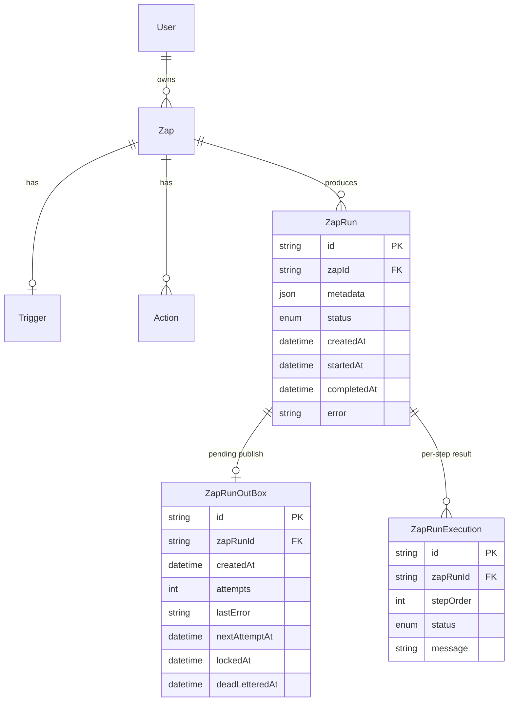

# Architecture

Deeper technical reference for the webhook → outbox → Kafka → worker
pipeline. See the [README](../README.md) for the high-level pitch; this
document is written for someone about to study or interview on the design.

## Service responsibilities

| Service | Responsibility | Talks to |
|---|---|---|
| `apps/web` | Auth, zap CRUD, execution history UI | Postgres |
| `apps/hooks` | Webhook ingestion: durably records a `ZapRun` + outbox row | Postgres |
| `apps/outbox-processor` | Claims outbox rows, publishes to Kafka, acks by deleting | Postgres, Kafka (producer) |
| `apps/processor` | Consumes Kafka, executes a run's actions, persists results | Postgres, Kafka (consumer), third-party APIs |
| `packages/processor` | Action handlers (email/http/solana) + the step-execution engine | Resend, `fetch`, Solana RPC |
| `packages/validation` | Zod schemas, including the shared Kafka event contract | — |
| `packages/db` | Prisma schema/migrations/seed, generated client | Postgres |
| `packages/logger` | Structured (JSON) logging shared by the backend services | stdout/stderr |

Each backend service is a separate `pnpm`/Turborepo app so it can be
reasoned about, tested, and (in principle) scaled independently — the worker
is the one most likely to need multiple instances, and it's built to support
that (see Concurrency below).

## Database schema (execution-relevant subset)



`ZapRunOutBox.zapRunId` is unique — one run produces exactly one outbox row.
`ZapRunExecution` is unique on `(zapRunId, stepOrder)`, which is what makes
step-level resumption safe: a redelivered event upserts, never duplicates.

`ZapRun -> ZapRunExecution` and `ZapRun -> ZapRunOutBox` cascade on delete.
They didn't originally — `Zap -> ZapRun` cascaded, but deleting a `Zap` that
had ever actually run left the underlying `ZapRunExecution`/`ZapRunOutBox`
rows unable to cascade with it, so deleting any zap with run history threw a
foreign-key violation (`DELETE /api/v1/zap/[zapId]`). Found and fixed while
smoke-testing the pipeline end to end; covered by a regression test in
[`route.test.ts`](../apps/web/app/api/v1/zap/%5BzapId%5D/route.test.ts).

## Webhook ingestion

`POST /hooks/catch/:userId/:zapId` ([`apps/hooks/src/app.ts`](../apps/hooks/src/app.ts)):

1. Looks up the zap by `(id, userId)` — 404 if it doesn't exist. (The
   original implementation created a `ZapRun` for any `zapId` string without
   checking; a bad request would only fail on the foreign key.)
2. If the trigger's metadata has a `secret` configured, requires a matching
   `x-zap-secret` header — 401 otherwise. If no secret is configured, the
   endpoint stays public (the UUID zap ID is already the unguessable part;
   the endpoint is meant to be triggerable without a login).
3. Body is capped at 256kb; malformed JSON gets a clean `400` instead of
   Express's default HTML error page.
4. A per-process rate limiter (`express-rate-limit`, 120 req/min/IP by
   default) bounds abuse — see Limitations for why this doesn't scale past
   one instance.
5. On success: one transaction creates the `ZapRun` and its `ZapRunOutBox`
   row, and the response is `202 Accepted` with the `zapRunId` — the caller
   never waits on Kafka or the worker.

## Transactional outbox

See the README's [Transactional outbox](../README.md#transactional-outbox)
section for the narrative explanation (why it exists, the failure window it
does and doesn't close). This section covers the mechanics.

`claimAndPublishBatch` ([`apps/outbox-processor/src/claimAndPublish.ts`](../apps/outbox-processor/src/claimAndPublish.ts)):

```sql
SELECT id, "zapRunId" FROM "ZapRunOutBox"
WHERE "deadLetteredAt" IS NULL AND "nextAttemptAt" <= now()
ORDER BY "createdAt" ASC
LIMIT $1
FOR UPDATE SKIP LOCKED
```

This runs inside a Prisma interactive transaction. `FOR UPDATE SKIP LOCKED`
means a second concurrent processor's claim query simply skips rows already
locked by the first — no double-claiming, no need for an application-level
mutex. The transaction then publishes to Kafka and deletes the claimed rows
before committing. The `lockedAt` column is set for observability (so a
stuck row is visible in the DB) but is **not** what provides correctness —
that's the transaction + `FOR UPDATE SKIP LOCKED` combination. Concurrent
safety is asserted directly in
[`claimAndPublish.test.ts`](../apps/outbox-processor/src/claimAndPublish.test.ts)
by running two claimers against the same seeded rows in parallel and
checking for zero overlap.

**Polling.** A `setTimeout` loop, not `setInterval` and not a hot
`while (true)` — the next poll is only scheduled after the current batch
finishes, so a slow batch can't stack up concurrent polls. If a batch was
full (`count === batchSize`), the next poll fires immediately to drain
backlog; otherwise it waits `OUTBOX_POLL_INTERVAL_MS` (default 500ms).

**Retry / backoff / dead-letter.** A failed `producer.send()` (caught around
the whole transaction) triggers a raw `UPDATE` outside the failed
transaction: `attempts += 1`, `lastError` recorded, and
`nextAttemptAt = now() + min(30s, attempts * 2s)`. Once `attempts >=
OUTBOX_MAX_ATTEMPTS` (default 5), `deadLetteredAt` is set and the claim
query's `WHERE deadLetteredAt IS NULL` permanently excludes it. There is no
separate dead-letter table — the row stays in `ZapRunOutBox` for inspection,
which is simpler and sufficient at this scale.

**Graceful shutdown.** `SIGTERM`/`SIGINT` stop scheduling further polls,
await any in-flight batch, then disconnect the Kafka producer and Prisma
client before exiting.

## Kafka event contract

Defined once, in [`packages/validation/src/event/event.schema.ts`](../packages/validation/src/event/event.schema.ts),
and used by both the producer (outbox-processor) and the consumer (worker)
so they can't drift apart:

```json
{
  "eventId": "<outbox row id>",
  "eventType": "zap.run.created",
  "version": 1,
  "zapRunId": "...",
  "zapId": "...",
  "occurredAt": "<ZapRun.createdAt, ISO>",
  "publishedAt": "<publish time, ISO>"
}
```

The original implementation published `{ zapRunId, stage: index }`, where
`stage` was the row's position within the current poll batch — not a real
workflow stage. It was parsed by the worker but never actually used (the
worker always reloads the full run and recomputes the real execution plan
from the database). The new schema drops it and adds `eventId`/`eventType`/
`version` so the contract is explicit, versioned, and validated with
`safeParseZapEvent` before either side trusts it.

**Partition key.** Messages are keyed by `zapId`, not `zapRunId` — every run
of the same zap lands in the same partition and is observed in order
relative to each other. Ordering *within* a single run doesn't need a
partition guarantee, because a run is one message; the worker reloads the
full step list from Postgres and executes it in `sortingOrder`, not from
anything encoded in the Kafka message.

## Worker / consumer

[`apps/processor/src/index.ts`](../apps/processor/src/index.ts):

1. `safeParseZapEvent` rejects malformed JSON or a payload missing required
   fields — this is treated as a **poison message**: log and commit
   immediately, no retry (retrying a message that will never parse is a hot
   loop).
2. Loads the `ZapRun`. Missing → poison, commit. Already terminal
   (`SUCCESS`/`FAIL`) → cheap no-op, commit (idempotent redelivery).
3. Otherwise runs `processActions` ([`packages/processor`](../packages/processor/src/actions/controller/controller.actions.ts)):
   iterates actions in `sortingOrder`, skips any step already `SUCCESS`,
   executes the rest, and stops at the first failure rather than continuing
   a broken workflow. Every attempted step is upserted into
   `ZapRunExecution` (`SUCCESS`/`FAIL` + a message), which is what makes the
   skip-on-resume logic possible.
4. The run's overall `ZapRun.status` is set from the result:
   `SUCCESS`/`FAIL`, with `completedAt` and (on failure) `error`.
5. **Failure classification, not commit-no-matter-what.** An exception
   raised by *the worker's own code* (e.g. the DB connection dropping while
   loading a run) triggers up to `WORKER_MAX_INFRA_RETRIES` (default 3)
   bounded local retries with a short backoff before the offset is
   committed and the run is marked `FAIL`. An action returning
   `{ success: false }` (bad recipient address, non-2xx HTTP response, etc.)
   is a **business failure** — recorded immediately, offset committed, no
   retry, because retrying identical bad input won't help. The original
   implementation always committed regardless of what happened, which meant
   a transient DB outage silently dropped the event forever.
6. `fromBeginning` and the broker list are environment-driven
   (`KAFKA_FROM_BEGINNING`, `KAFKA_BROKERS`) rather than hardcoded — a fresh
   consumer group defaults to *not* replaying the whole topic history.

## Idempotency, concretely

| Redelivery scenario | What happens |
|---|---|
| Same Kafka message redelivered (consumer restart before commit) | `processZapRun` sees the run's steps already `SUCCESS`, skips them |
| Outbox republishes the same run (crash before delete commits) | Same as above — the worker doesn't know or care how many times the event was published |
| Worker crashes mid-step, after the action's side effect but before the `ZapRunExecution` upsert | **Not fully closed in general.** For the email action specifically, a deterministic `idempotencyKey` (`zapRunId:stepOrder`) is passed to Resend, so a redelivered send is deduplicated by Resend itself. HTTP/Solana actions don't have this guarantee — documented as a limitation, not hidden. |

## Action execution

[`packages/processor/src/actions/service`](../packages/processor/src/actions/service):
`email` (Resend), `http` (native `fetch`, `AbortController` timeout via
`ACTION_HTTP_TIMEOUT_MS`), `solana` (devnet transfer). All three validate
their metadata before doing anything, render `{{payload.x}}` /
`{{steps.N.x}}` templates against the trigger payload and prior step
results, and return a uniform `{ success, ... }` shape so the controller
doesn't need to know which action ran.

## Concurrency

The outbox processor is safe to run as multiple instances today (proven by
test). The worker is a standard Kafka consumer group member — running
multiple instances is safe by construction (Kafka won't give two consumers
in the same group the same partition) and requires no code change, though
this repo runs a single instance locally.

## Authorization boundaries

- Every zap-scoped web API route filters by `(id, userId)` — cross-user
  access returns `404`.
- `apps/web/lib/middleware/auth.middleware.ts` gates the page/API routes
  listed in `proxy.ts`'s matcher server-side; each route additionally
  re-checks the JWT itself (defense in depth, not reliance on one layer).
- The webhook endpoint is intentionally not behind user auth (public
  trigger URLs are the point) but validates zap ownership implicitly via
  the `(userId, zapId)` path and supports an optional shared secret.

## Known limitations / trade-offs

- **At-least-once delivery** from outbox → Kafka is inherent to the design
  (no distributed transaction across Postgres and Kafka) — see the README.
- **Rate limiting is per-process** — `express-rate-limit`'s default in-memory
  store only bounds a single `hooks` instance.
- **HTTP/Solana actions aren't idempotent** at the third-party boundary.
- **`AvaialableAction`** (and the matching `avaialableAction` Prisma client
  accessor) is a pre-existing typo in the schema, left uncorrected — fixing
  it means a migration and touching every call site purely for cosmetics,
  which wasn't judged worth the churn/risk for this pass.
- **Action-level infra failures aren't retried** — only worker-level
  infrastructure failures (e.g. losing the DB connection mid-run) get
  bounded retries; a third-party API being down today just fails the run.
